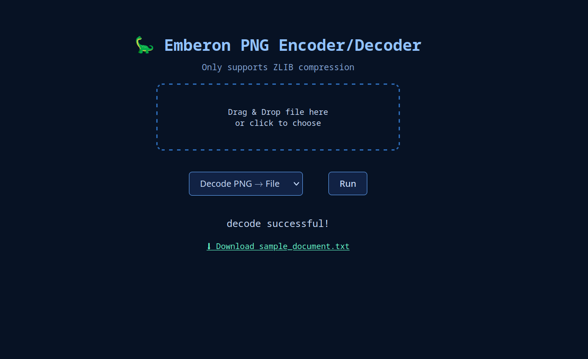

# Emberon Web PNG Encoder/Decoder

**Emberon** lets you turn any file into a PNG image and later recover it back perfectly.

[Emberon Main Project](https://github.com/tempdev-bit/emberon-web)

Emberon Web is an website created to do the same, just in a browser!
Everything runs **offline in your browser** using Python (via Pyodide + Pillow).  

---

## ✨ Features
- 100% **lossless** — original file restored exactly  
- **Runs locally** — no server, no upload  
- Uses **PNG pixels** as the carrier  
- Built-in **compression + integrity check**  
- **Drag & Drop UI**  

---

## 🛡️ Try It
1. Open (https://emberon.pages.dev) in your browser.  
2. Drag & drop a file.  
3. Choose **Encode → PNG** or **Decode PNG → File**.  
4. Click **Run** and download your result.  

---

## Screenshots

---

## 📂 How It Works
- File data is compressed + hashed  
- A header + payload is packed into RGBA pixels  
- Result is a standard PNG that can be decoded back  

---

## ⚙️ Tech
- [Pyodide](https://pyodide.org) → Python in the browser  
- [Pillow](https://pillow.readthedocs.io) → image handling  
- HTML + CSS + JS → drag & drop interface  

---

## 🛡️ Notes
- Files **never leave your machine**  
- PNGs are **not encrypted** (just encoded)  

---

## 📜 License
MIT © 2025 Snow

 Made with ❤️ by solar. 
